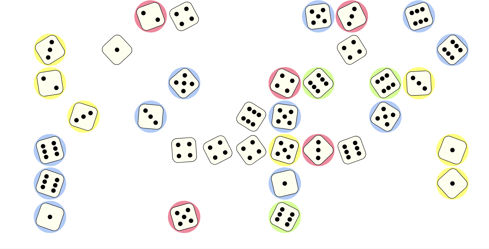

*Continuously thrown dice* is a simple animation of dice being thrown, added,
and removed on the board. Typically, something like this program would be used
as a winning animation in a dice game, or to show when a game is on pause.

It is also a nice example of how to use the *twenty-one-pips* dice-game
libary. It shows:

*   How to setup an [HTML file](./index.html) with a dice-board and a couple of players.
*   How to setup interaction with the dice-board via [JavaScript](./index.js):

    *   Adding and removing dice,
    *   Throwing dice,
    *   Holding and releasing dice by a player,
    *   Taking into account the maximum number of dice that can be played on
        the board.

